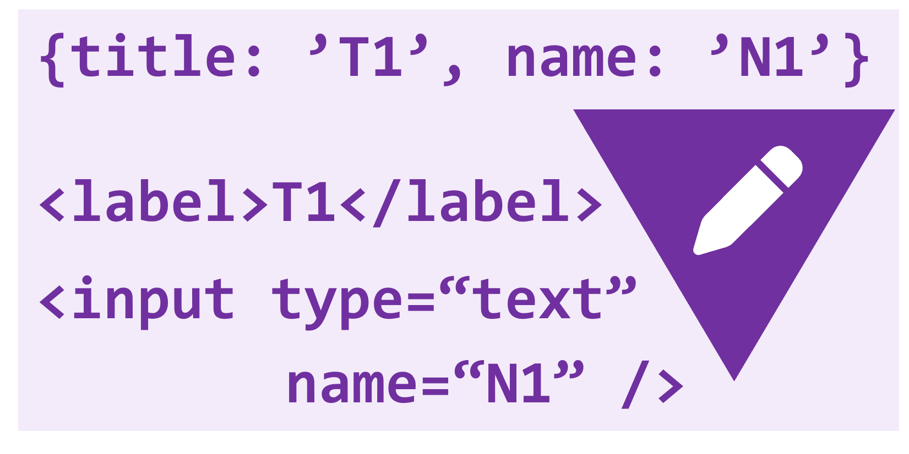
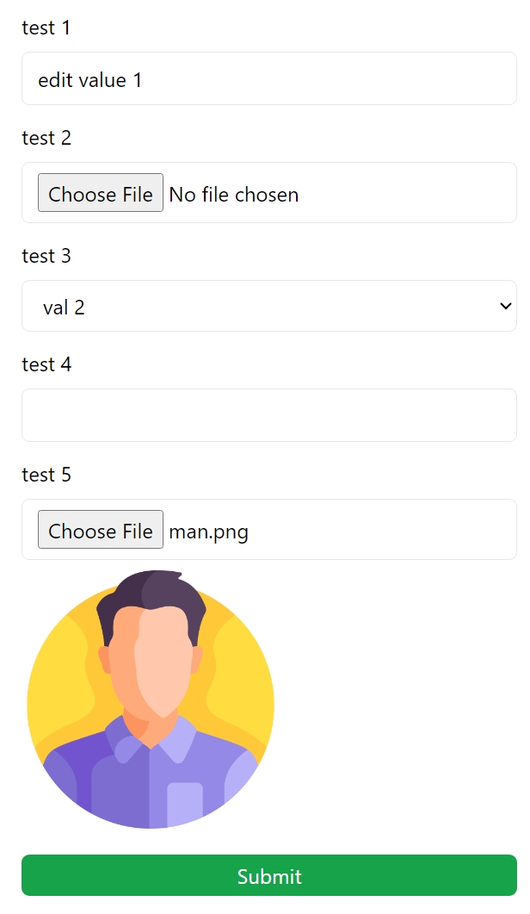

# General Form Next.js



## Creating a form in Next.js quickly and easily

With this package, you can easily create information entry forms in next.js and make the process of building your programs faster and easier.

## Install and Import

Install generalform-nextjs component

```bash
npm install generalform-nextjs --save
```

Import generalform-nextjs in your Next.js component file by

```tsx
import GeneralForm_Nextjs, {
  GeneralFormItem,
} from "@/app/components/GeneralForm_Nextjs";
```

## Simple Example

in file `page.tsx` should `"use client"` used

```tsx
"use client";
import GeneralForm_Nextjs, {
  GeneralFormItem,
} from "@/app/components/GeneralForm_Nextjs";
import { FormEvent, useState } from "react";

const items: GeneralFormItem[] = [
  {
    title: "test 1",
    name: "test1",
    type: "text",
    value: "edit value 1",
    required: false,
  },
  { title: "test 2", name: "test2", type: "file", required: true },
  {
    title: "test 3",
    name: "test3",
    type: "select",
    value: "val2",
    options: [
      { name: "val1", title: "val 1" },
      { name: "val2", title: "val 2" },
      { name: "val3", title: "val 3" },
    ],
  },
  {
    title: "test 4",
    name: "test4",
    type: "text",
    required: true,
    value: "",
  },
  { title: "test 5", name: "test5", type: "file" },
];

export default function Home() {
  const [data, setData] = useState<GeneralFormItem[]>(items);

  const onSubmit = (e: FormEvent) => {
    e.preventDefault();
    console.log(data);
  };

  return (
    <div className="container mx-auto my-5">
      <GeneralForm_Nextjs data={data} setData={setData} onSubmit={onSubmit} />
    </div>
  );
}
```

## Demo image



## API

### Props API

| Name     | Type                       | Description                                                                  |
| -------- | -------------------------- | ---------------------------------------------------------------------------- |
| title    | string                     | This field is created to create a label                                      |
| name     | string                     | This is used for the name and id of the `input` field                        |
| required | boolean                    | This is used for required `input` fields                                     |
| value    | string , number , File     | Set for input values                                                         |
| type     | "text" , "file" , "select" | It is set for the type of inputs                                             |
| options  | GeneralFormItem[]          | This is for when `type` is equal to `select`, you can use `option` to set it |

## Example with all the available props

for `<input type="text" />`

```tsx
const items: GeneralFormItem[] = [
  {
    title: "test 1",
    name: "test1",
    type: "text",
    value: "edit value 1",
    required: false,
  },
];
```

for `<input type="file" />`

```tsx
const items: GeneralFormItem[] = [
  { title: "test 2", name: "test2", type: "file", required: true },
];
```

for `<select />`

```tsx
const items: GeneralFormItem[] = [
  {
    title: "test 3",
    name: "test3",
    type: "select",
    value: "val2",
    options: [
      { name: "val1", title: "val 1" },
      { name: "val2", title: "val 2" },
      { name: "val3", title: "val 3" },
    ],
  },
];
```

---

## License
generalform-nextjs is released under the MIT license.

---

### **Developer: Mohammad Sadra Boromand**